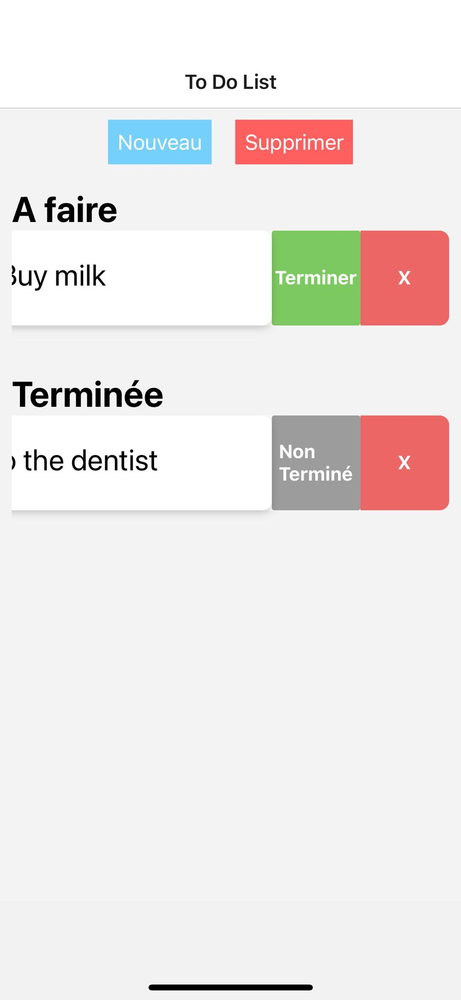

# Todo List

|   Nom           | Prénom   |
|-----------------|----------|
|   ALONSO TORT   |  Andoni  |


## Required technologies

You will need the following technologies:
- [Android Studio](https://developer.android.com/studio "Android Studio") and also [JDK 20+](https://www.oracle.com/fr/java/technologies/downloads "JDK")
- [NodeJS LTS](https://nodejs.org/fr "NodeJS")


The purpose of this application is to create a task manager (TAR).
L'application doit comprendre les fonctionnalités suivantes :

- [ ] View current and finalized TARs
- [ ] Delete all TARs
- [ ] Add an ART. ART must persist.
- [ ] Possibility of changing the status of an ART from 'completed' to 'in progress' (and vice versa)
- [ ] Ability to swipe the TARs in the lists to delete them.

`Expo.SecureStore` used for data persistence.

## Informations

The project was created using the following command:

```shell
npx create-expo-app -t expo-template-blank-typescript
```

It is possible to launch the application in an Android and/or iOS emulator:

```shell
npx expo run:android  # npx expo run:ios
```
If you encounter some problems with the last command you can also try

```shell
npx expo start
```

==== MENU ===


==== NOUVEAU (NEW) ====


=== ACTIONS ====

If we swipe the element we can finish, unfinish or delete the task.


If we want to delete all the elements we have to click on the delete button from the menu and all will be deleted.
